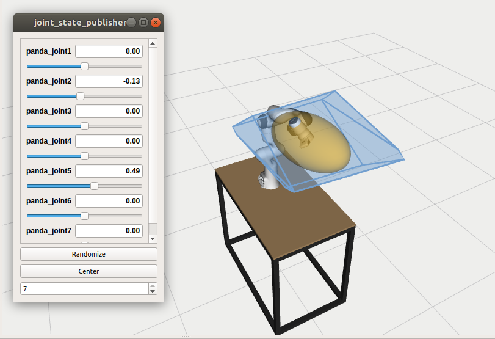
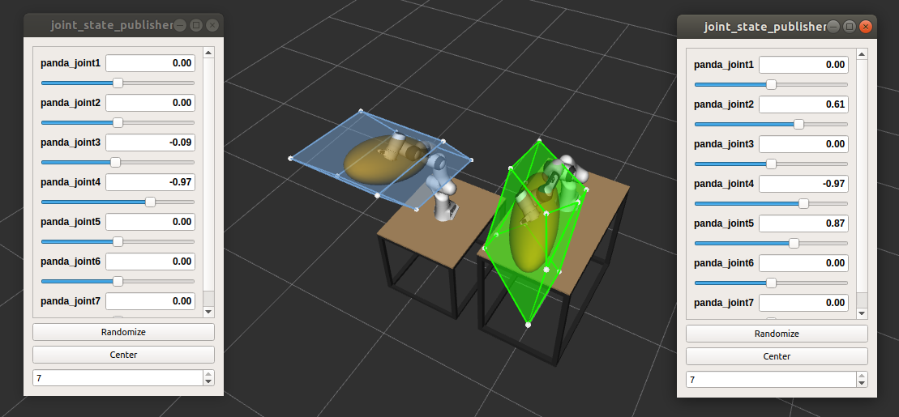
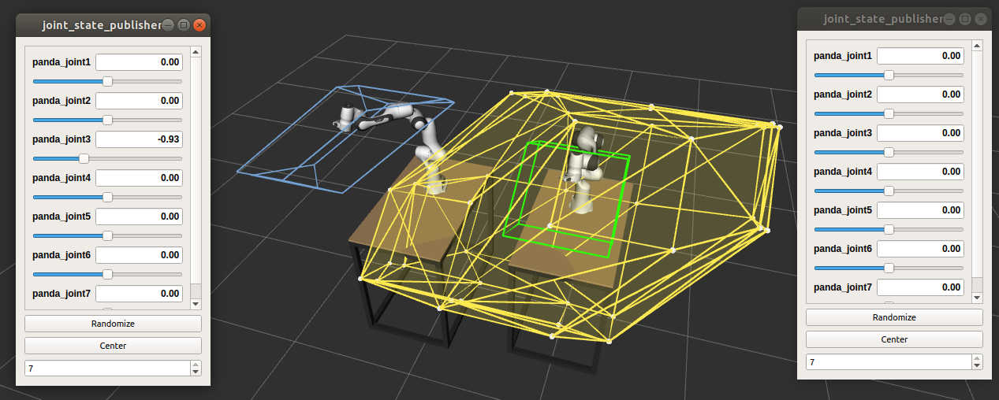
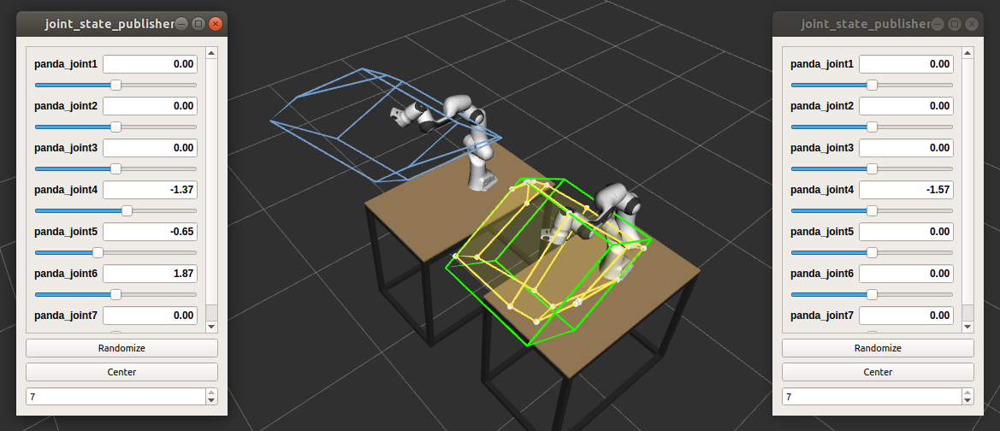

# On-line force capability evaluation based on efficient polytope vertex search

*by Antun Skuric, Vincent Padois, David Daney*<br>
*Published at ICRA2021*


New on-line polytope vertex search algorithm optimised for force and velocity polytope evaluation of serial robots.

This repository consists of 
- [Matlab/octave implementation](#matlab-octave-testing-scripts)
    - full modular algorithm implementation
    - benchmarking comparison of three vertex search algorithms for *FRANKA Emika Panda* and *UR5* robot
- [Python module for calculating robot capacity](#python-capacity-module) `pycapacity`
    - force polytope
    - force/velocity manipulability ellipsoid
    - quick demo jupyter script
- [ROS node for *FRANKA Emika Panda* robot](#ros-panda-capacity-package)


## Matlab / Octave testing scripts

In the `matlab_octave` directory you can find two testing scripts intended for benchmarking of vertex search algorithms
```matlab
panda_test_polytope_algorithms
``` 
and 
```
ur5_test_polytope_algorithms
```

They are both testing the performance of three vertex search algorithms on *Franka Emika Panda* robot and *UR5* robot:

> *On-line force capability evaluation based on efficient polytope vertex search <br> by Antun Skuric, Vincent Padois, David Daney*
```matlab
[f_vert, matrix_inverse_count] = polytope_auctus(Jacobian_mat,tau_min,tau_max);
```

> *Evaluation of Force Capabilities for Redundant manipulatiors <br> by
P.Chiacchio, Pierrot et al.*
```matlab
[f_vert, matrix_inverse_count] = polytope_pierrot(Jacobian_mat,tau_min,tau_max);
```

> *Vertex search algorithm of convex polyhedron representing upper limb manipulation ability  <br> by Sasaki et al.*
```matlab
[f_vert, matrix_inverse_count] = polytope_sasaki(Jacobian_mat,tau_min,tau_max);
```

## Python capacity module

In this directory you can find the generic robot capacity calculation module called `pycapacityRT` which you can easily integrate in your python project, for example
```python
import pycapacityRT.pycapacity as capacity
```
### Module functions
- [`force_polytope`](./pycapacity/docs/pycapacity.md#function-force_polytope): Force polytope representing the capacities of the two robots in a certain configuration
- [`force_polytope_intersection`](./pycapacity/docs/pycapacity.md#function-force_polytope_intersection): Force polytope representing the intersection of the capacities of the two robots in certain configurations.
- [`force_polytope_intersection_withfaces`](./pycapacity/docs/pycapacity.md#function-force_polytope_intersection_withfaces): Force polytope representing the intersection of the capacities of the two robots in certain configurations.
- [`force_polytope_sum_withfaces`](./pycapacity/docs/pycapacity.md#function-force_polytope_sum_withfaces): Force polytope representing the minkowski sum of the capacities of the two robots in certain configurations.
- [`force_polytope_withfaces`](./pycapacity/docs/pycapacity.md#function-force_polytope_withfaces): Force polytope representing the capacities of the two robots in a certain configuration.
- [`manipulability_force`](./pycapacity/docs/pycapacity.md#function-manipulability_force): force manipulability calculation
- [`manipulability_velocity`](./pycapacity/docs/pycapacity.md#function-manipulability_velocity): velocity manipulability calculation
---

See [`demo_notebook.ipynb`](./pycapacity/demo_notebook.ipynb) for one example use case of the module.

## ROS panda capacity package
In the `ROS_nodes` directory you can find the implementation of the python capacity module for a specific use case of Panda robot. The directory consists of two ros packages:
- hkl-kdl: a fork of  http://wiki.ros.org/hrl-kdl
- franka_description: Panda robot definitions from Franka Emika  http://wiki.ros.org/franka_description
- **panda_capacity: the capacity solver for Panda robot**

### Install the ros packages - using catkin
To run panda robot capacity calculation nodes first clone the repository and submodules:
```shell
git clone --recurse-submodules git@gitlab.inria.fr:askuric/polytope_vertex_search.git
```

Then create new catkin workspace:
```shell
mkdir ~/capacity_ws && cd ~/capacity_ws/
mkdir src && cd src
```
Then you can copy the folders from ROS_nodes into the `capacity_ws/src` folder for example:
```shell
cp -r ~/polytope_vertex_search/ROS_nodes/* .
```

Finally you can build the workspace
```shell
cd ..
catkin_make
```
And you should be ready to go!


#### Visualisation dependancies
For visualizing the polytopes in RVZ you will need to install the [jsk-rviz-plugin](https://github.com/jsk-ros-pkg/jsk_visualization)

```sh
sudo apt install ros-*-jsk-rviz-plugins # melodic/kinetic... your ros version
```

### One panda simulation
Once when you have everything installed you will be able to run the interactive simulations and see the polytope being visualised in real-time.



To see a simulation with one panda robot and its force and velocity manipulatibility ellipsoid and polytope run the command in the terminal.

```shell
source ~/capacity_ws/devel/setup.bash 
roslaunch panda_capacity one_panda.launch
```


### Two panda simulation

To demonstrate the collaborative robotics applications of our algorithm we have provided an interactive simulation of two panda robots where use can visualise their separate and joint force capacities. 



For the interactive simulation of two panda robots with their own capacity measures you can simply run the commands:
```shell
source ~/capacity_ws/devel/setup.bash 
roslaunch panda_capacity two_panda.launch
```

#### Minkowski sum of polytopes


Open a new terminal and run the command:
```shell
rosrun panda_capacity panda_force_polytope_sum.py
```

#### Intersection of polytopes


Open a new terminal and run the command:
```shell
rosrun panda_capacity panda_force_polytope_intersection.py
```